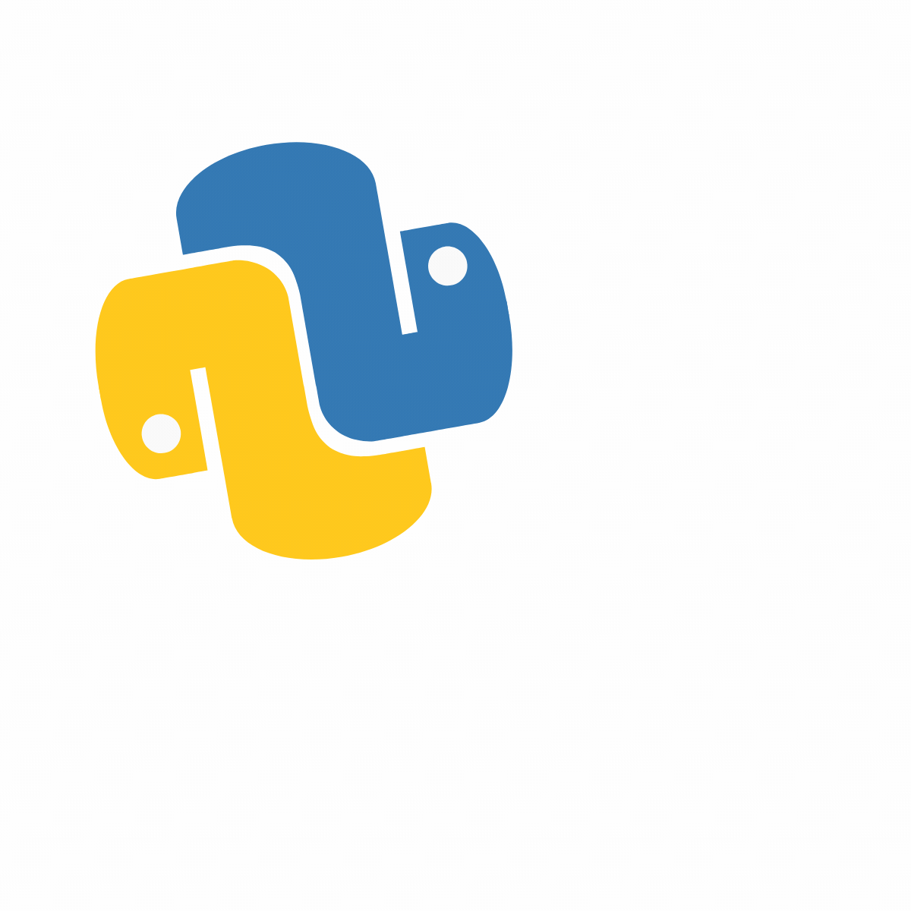

## To hiring managers and recruiters checking this repository:

There are three sub-folders in this repository: 

1. Data Analysis:Python coding samples in Visual Studio(data analysis and ML) and R coding samples in R-studio(data analysis and ML) in data analysis folder which has three sub-sub folders: 

        

i. [Python](data_analysis/python/): a sample for bootstrapping technique and another sample for time-series analysis

ii. [R-studio](data_analysis/R_studio/): A word generation from news headlines to predict market volatility.

iii. [Data visualization samples](data_analysis/data_viz_sample/): Producing data visualization about crime and housing in Boston and how different factors contribute to pricing, crime included. 

2. High Performance computing (AWS and clusters) in HPC folder  

3. Prompt engineering in AI folder: using WSJ news topics for generating prompts with different personas

no file is a full project and therefore is not producable. I have removed loading packages and datasets. each subfolder however, has a readME file that redirects you to the original complete project in case you wanted to see the whole process.

